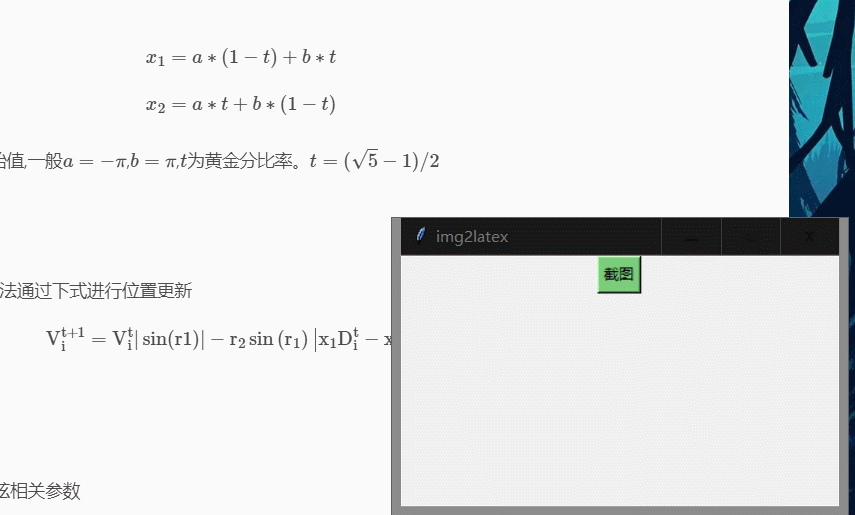

# latex_ocr
本仓库中包含两个平台的ocr公式识别请求API代码 修改一下appid和密钥什么的就可以用

## 运行方式
### 科大讯飞平台
<https://console.xfyun.cn/>
1. 进入`/xf`目录
2. 修改`WebITRTeach.py`文件中的`APPID` `Secret` `APIKey`三个参数（自己去平台上申请）
3. 运行`python3 main.py`
4. 识别成功后`CTRL`+`V`粘贴公式
> `PrScrn.dll`是微信的截图dll文件，拿过来用一下。    
运行截图：  

### 好未来平台
<https://ai.100tal.com/>
1. 进入`/hwl`目录
2. 修改`access_key_id` `access_key_secret`两个参数
3. 运行`python3 latexOcr.py`     
   
## 总结
好未来平台识别的公式比科大讯飞的准 但是只有个100次 

我选择用科大讯飞 识别错改一下就行了 每个月有500次免费的额度

## TODO
- [x] 科大讯飞添加截图转换   
- [ ] 界面快捷键后台运行

2022年8月26日：  
- [x] gui编写